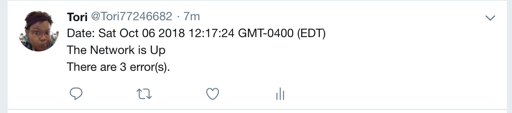
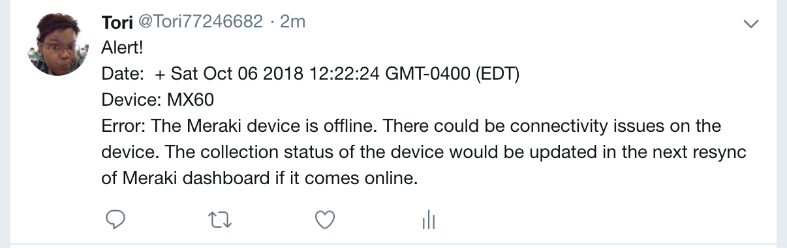

# ncat_hack

### Note:
This is a Node App.
In order to run this program node modules will need to be installed from the package.json file, and a .env file with Twitter keys will need to be added.

## Background

Cisco DNA-Center is the evolution of how users will interact with their networks.  With an intuitive user interface coupled with a robust DNA-C API, interactions is limited only by human imagination of what's possible.

### Challenge

The NC A&T hack-a-thon challenge is to use Cisco DNA-Center API in conjunction with other available open-source APIs to accomplish the following tasks:

(1) Use a twitter account to 'tweet' an hourly network status report.  The tweet should be brief and convey only the key points, for example:

* Date/Time: The network is up!  No issue detected
* Date/Time: The network is up!  (2) issues detected within the past hour

(2) Use a twitter account to 'tweet' an alert when a network device has a problem.  This tweet should also be brief.  An example follows:

* Date/Time: ALERT: asr1001-x-.abc.inc is experiencing high CPU utilization

